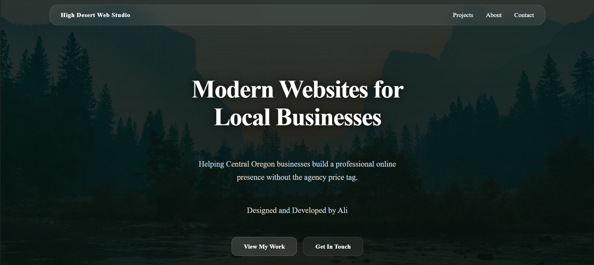
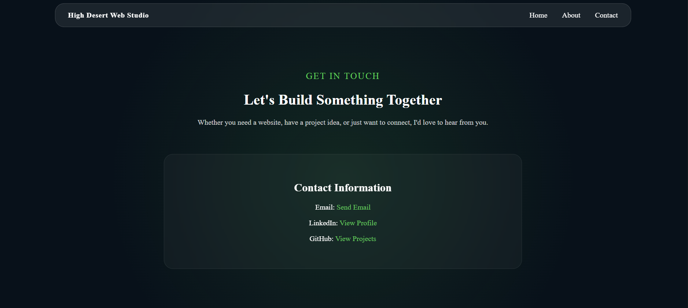

High Desert Web Studio

A personal portfolio and web development business website built to showcase projects, skills, and services.

Live Site: https://high-desert-web-studio.onrender.com/

Overview
High Desert Web Studio is a responsive website designed and developed by Ali. The site serves as both a portfolio and a landing page for freelance web development work, featuring project showcases, contact information, and personal background.
The goal of the project is to provide local businesses and organizations with modern, accessible websites while documenting my growth as a developer.

## Homepage

## Contact Page

Features
* Responsive design
* Project showcase pages
* About page
* Contact page
* Custom styling and branding
* Links to GitHub, LinkedIn, and featured projects
* Mobile-friendly layout

Featured Projects

Nova Labs
A cybersecurity learning platform focused on making technical concepts approachable through hands-on learning and interactive content.

ByteGuard
A networking-focused educational project designed to help users understand common networking concepts and troubleshoot connectivity issues.

Reality Check
A Chrome extension that helps users identify AI-generated content, uncited claims, and potentially misleading information online.

Technologies Used
* HTML5
* CSS3
* JavaScript
* Git
* GitHub
